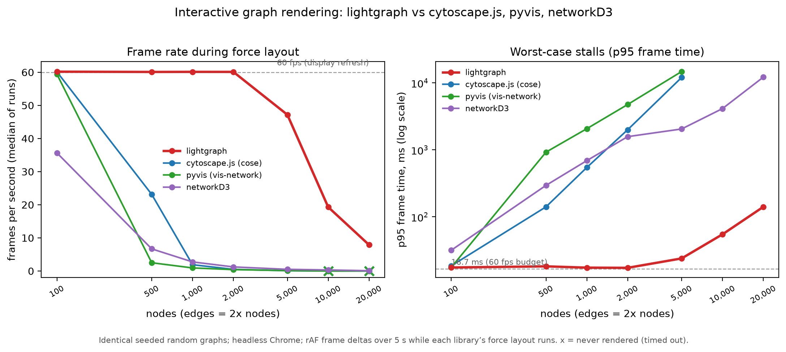

Benchmarks
==========

How does lightgraph compare to other force-directed network visualization
libraries you can drop into a notebook or an R script? We benchmarked it
against `cytoscape.js <https://js.cytoscape.org/>`_,
`pyvis <https://github.com/WestHealth/pyvis>`_ (vis-network), and
`networkD3 <https://christophergandrud.github.io/networkD3/>`_ on identical
graphs.

         cytoscape.js, pyvis, and networkD3
   :width: 100%

**lightgraph is the only library still at the 60 fps display cap past 500
nodes, and the only one that keeps 10,000+ node graphs interactive at all.**

Setup
-----

- Every library renders the *same graph* at each size: seeded Erdős–Rényi
  random graphs (seed 42), from 100 nodes / 200 edges up to 20,000 nodes /
  40,000 edges.
- Each page embeds the same probe: wait for the library's first non-empty
  canvas/SVG, wait 500 ms so the force layout is actively running, then
  measure ``requestAnimationFrame`` frame deltas for 5 seconds.
  ``requestAnimationFrame`` fires once per displayed frame regardless of
  which library scheduled it, so the deltas are the true on-screen frame
  rate while the layout runs.
- Headless Google Chrome on an Apple M1; medians of 3 runs
  (captured 2026-07-10). Library defaults, except node labels are turned
  off for lightgraph because the other libraries don't draw labels by
  default. Versions: lightgraph 1.1.0 (with d3 v7), cytoscape.js 3.30.4
  (cose layout), pyvis 0.3.2 on vis-network 9.1.2, networkD3 0.4.1.

Results
-------

Median frames per second during force layout ("—" = the library never
produced a first render before the 120 s harness timeout):

.. list-table::
   :header-rows: 1
   :widths: 12 12 19 19 19 19

   * - Nodes
     - Edges
     - lightgraph
     - cytoscape.js
     - pyvis
     - networkD3
   * - 100
     - 200
     - **60.2**
     - 60.1
     - 59.4
     - 35.7
   * - 500
     - 1,000
     - **60.1**
     - 23.1
     - 2.5
     - 6.7
   * - 1,000
     - 2,000
     - **60.1**
     - 1.9
     - 0.9
     - 2.7
   * - 2,000
     - 4,000
     - **60.1**
     - 0.5
     - 0.4
     - 1.2
   * - 5,000
     - 10,000
     - **47.2**
     - 0.1
     - 0.1
     - 0.5
   * - 10,000
     - 20,000
     - **19.3**
     - —
     - —
     - 0.3
   * - 20,000
     - 40,000
     - **7.9**
     - —
     - —
     - 0.1

Why the gap:

- **lightgraph** batches all edge and node drawing into a handful of canvas
  paths per frame, culls offscreen elements, and coalesces rendering to one
  draw per animation frame.
- **cytoscape.js** matches at 100 nodes, but the cose layout's per-tick
  cost takes over quickly (p95 frame time is ~2 s at 2,000 nodes); at
  10,000 nodes it never completes a first render.
- **pyvis** (vis-network) runs Barnes–Hut stabilization on the main thread
  before the first paint: 46 s to first render at 5,000 nodes, timeout at
  10,000.
- **networkD3** renders quickly at any size (the SVG appears immediately),
  but every simulation tick updates every SVG element, so interaction drops
  to 6.7 fps at 500 nodes and near-zero beyond 5,000.

Caveats
-------

These libraries use different force-layout engines, so this measures
user-perceived interactivity while the layout runs — the practical "can I
pan, zoom, and hover while it settles?" experience — not an isolated
render-loop microbenchmark.

Reproducing
-----------

The harness (shared graph generator, per-library page generators, headless
Chrome runner, and plotting script) lives in the
`benchmark/ directory <https://github.com/haozhu233/lightgraph/tree/main/benchmark>`_
of the repository; ``benchmark/benchmark.md`` documents the full
methodology and the step-by-step commands.
